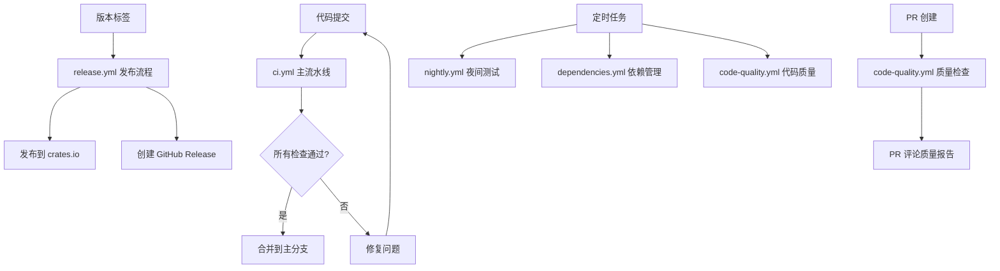

# diesel-gaussdb GitHub Actions Workflows

这个目录包含了 diesel-gaussdb 项目的完整 CI/CD 流水线配置。

## 📋 Workflow 概览

### 🔄 [ci.yml](./ci.yml) - 主要 CI/CD 流水线
**触发条件**: Push 到 main/develop 分支，PR，定时任务
**功能**:
- 代码质量检查 (格式化、Clippy)
- 多版本 Rust 测试 (stable, beta, nightly, MSRV)
- 多平台测试 (Linux, Windows, macOS)
- 真实数据库集成测试 (OpenGauss, PostgreSQL)
- 性能基准测试
- Diesel 兼容性测试
- 文档生成和验证
- 安全审计
- 发布准备
- 最终汇总报告

### 🚀 [release.yml](./release.yml) - 发布流程
**触发条件**: 推送版本标签 (v*)
**功能**:
- 创建 GitHub Release
- 发布到 crates.io
- 构建多平台二进制文件
- 更新文档
- 发布后验证

### 🌙 [nightly.yml](./nightly.yml) - 夜间测试
**触发条件**: 每日 2:00 UTC，手动触发
**功能**:
- 扩展的数据库兼容性测试
- 性能回归测试
- 内存泄漏检测
- 夜间测试汇总

### 📦 [dependencies.yml](./dependencies.yml) - 依赖管理
**触发条件**: 每周一 9:00 UTC，手动触发
**功能**:
- 检查依赖更新
- 安全漏洞扫描
- 自动创建更新 PR
- 许可证兼容性检查

### 📊 [code-quality.yml](./code-quality.yml) - 代码质量
**触发条件**: Push，PR，每周日 3:00 UTC
**功能**:
- 代码覆盖率分析
- 代码复杂度分析
- 质量检查 (格式化、Clippy、TODO 注释)
- 质量评分和汇总

## 🎯 工作流程图

## 🔧 配置说明

### 环境变量
- `CARGO_TERM_COLOR=always`: 彩色输出
- `RUST_BACKTRACE=1`: 详细错误信息
- `RUSTFLAGS="-D warnings"`: 将警告视为错误

### 数据库配置
- **OpenGauss**: `opengauss/opengauss:7.0.0-RC1.B023`
- **PostgreSQL**: `postgres:15`, `postgres:14`, `postgres:13`
- **测试数据库**: `diesel_test`
- **用户**: `gaussdb` / `Gaussdb@123`

### 缓存策略
所有 workflow 都使用 `actions/cache@v4` 来缓存 Cargo 注册表和构建产物，提高构建速度。

## 📊 测试矩阵

### Rust 版本
- `stable` - 稳定版
- `beta` - 测试版
- `nightly` - 每日构建版
- `1.70.0` - 最低支持版本 (MSRV)

### 操作系统
- `ubuntu-latest` - Linux
- `windows-latest` - Windows
- `macos-latest` - macOS

### 数据库版本
- OpenGauss 7.0.0, 6.0.0
- PostgreSQL 15, 14, 13

## 🎨 产物和报告

每个 workflow 都会生成详细的报告和产物：

### CI 流水线产物
- 集成测试报告
- 兼容性报告
- 文档
- 安全报告
- 最终 CI 报告

### 发布产物
- 源代码归档
- 多平台二进制文件
- 发布说明
- 发布后验证报告

### 夜间测试产物
- 数据库兼容性矩阵
- 性能基准结果
- 内存泄漏报告
- 夜间测试汇总

### 依赖管理产物
- 依赖更新报告
- 安全审计报告
- 许可证报告
- 依赖管理汇总

### 代码质量产物
- 代码覆盖率报告
- 复杂度分析报告
- 质量检查报告
- 质量评分汇总

## 🔐 所需的 Secrets

为了完整运行所有 workflow，需要配置以下 secrets：

- `GITHUB_TOKEN`: GitHub API 访问 (自动提供)
- `CARGO_REGISTRY_TOKEN`: crates.io 发布令牌

## 🚀 使用指南

### 开发流程
1. 创建功能分支
2. 提交代码 → 触发 CI 检查
3. 创建 PR → 触发质量检查和 PR 评论
4. 合并到 main → 触发完整 CI 流水线

### 发布流程
1. 更新版本号 (`Cargo.toml`)
2. 创建版本标签: `git tag v1.0.0`
3. 推送标签: `git push origin v1.0.0`
4. 自动触发发布流程

### 监控和维护
- 查看夜间测试结果
- 审查依赖更新 PR
- 监控代码质量趋势
- 处理安全漏洞警报

## 📈 质量指标

项目维护以下质量标准：
- **代码覆盖率**: ≥80%
- **代码复杂度**: ≤10 (平均)
- **安全漏洞**: 0
- **Clippy 警告**: 0
- **格式化**: 100% 符合 rustfmt

## 🤝 贡献指南

在提交 PR 之前，请确保：
1. 代码通过所有 CI 检查
2. 添加适当的测试
3. 更新相关文档
4. 遵循代码格式规范

## 📞 支持

如果您在使用这些 workflow 时遇到问题，请：
1. 检查 workflow 运行日志
2. 查看相关的报告产物
3. 在 GitHub Issues 中报告问题
